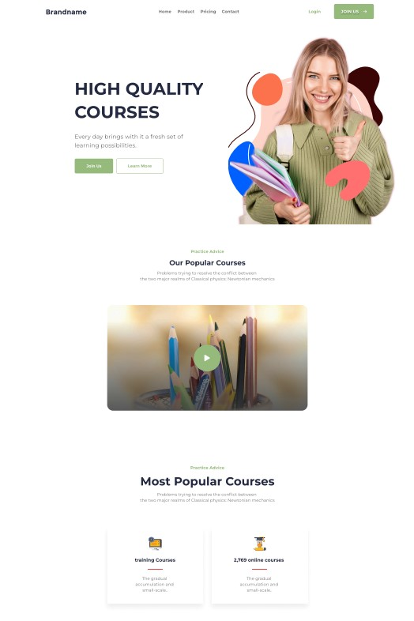
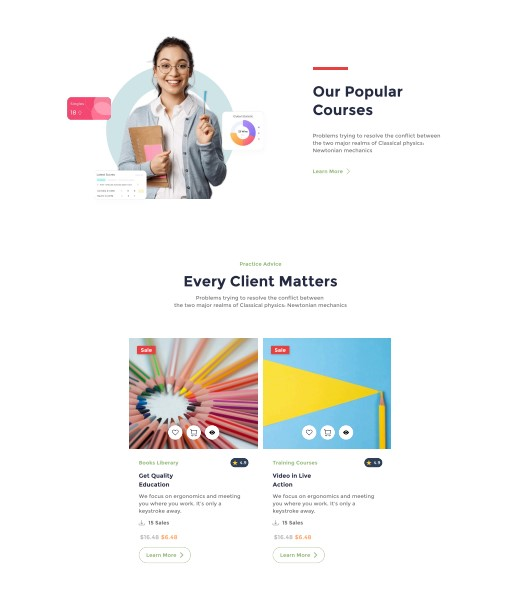
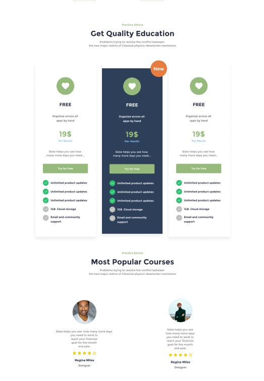
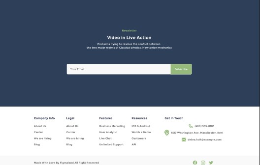

# 🎓 School Sharp 

  
  
  

  <h3>🚀 Landing page educacional moderna</h3>
  
Página institucional desenvolvida com HTML5 e CSS3 puro, focada em experiência do usuário e boas práticas de desenvolvimento

---

## 📋 Índice 
- 🎯 [Sobre o Projeto](#sobre-o-projeto)
- ✨ [Funcionalidades](#funcionalidades)
- 🎨 [Layout](#layout)
- 🛠️ [Tecnologias](#tecnologias)
- ♿ [Acessibilidade](#acessibilidade)
- 🌱 [Próximas Melhorias](#proximas-melhorias)
- 👨‍💻 [Autores](#autores)

---

## 🎯 Sobre o Projeto 
School Sharp é uma landing page educacional desenvolvida para demonstrar habilidades em **HTML semântico** e **CSS moderno**.  
O projeto foca em criar uma experiência visual atrativa e funcional para instituições de ensino.

### 🎨 Design Highlights 
- Interface limpa e moderna  
- Componentes reutilizáveis  
- Navegação intuitiva  

---

## 🛠️ Tecnologias 
- Semântica HTML5 (`<header>`, `<nav>`, `<main>`, `<section>`)  
- Layout com **Flexbox** e **CSS Grid**  
- Componentização visual  
- Organização profissional de assets  

---

## ✨ Funcionalidades 
- 🏠 Header responsivo com logotipo e navegação  
- 🎯 Hero section com CTA duplo (Join Us / Learn More)  
- 📚 Seção de cursos populares com imagem destacada  
- 🏆 Cards de categorias (Training Courses, Online Courses)  
- 📱 Design responsivo para múltiplos dispositivos  
- ♿ Acessibilidade com textos alternativos e semântica  

---

## 🎨 Layout 
### Desktop Preview 

---

## ♿ Acessibilidade 
Este projeto segue as diretrizes de acessibilidade web:

- ✅ Textos alternativos descritivos em todas as imagens  
- ✅ HTML semântico para melhor navegação com leitores de tela  
- ✅ Contraste adequado entre texto e fundo  
- ✅ Foco visível em elementos interativos  
- ✅ Estrutura lógica de heading tags  

---

## 🌱 Próximas Melhorias 

### 🎯 Roadmap 
- Responsividade completa (320px, 768px, 1024px, 1440px)  
- Animações CSS (hover effects, scroll animations)  
- Dark mode toggle  
- SEO melhorado (meta tags, schema markup)  
- Progressive Web App (PWA) features  
- Internacionalização (i18n)  

---

## 👨‍💻 Autores 

  <h3>Eduardo, Pablo e Bruno</h3>

---

  
⭐ Se este projeto te ajudou, considere dar uma estrela!

  
💬 Tem alguma sugestão? Abra uma issue ou pull request!

